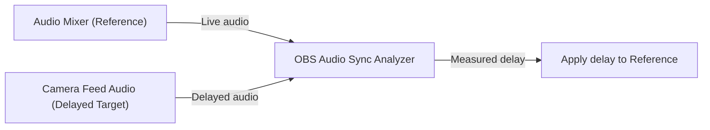

# Audio Sync Analyzer

## Introduction

Audio Sync Analyzer adds an OBS audio dock that analyzes and corrects sync between sources using cross-correlation.

Audio is sampled from the two audio inputs and a numerical correlation is done to identify the delay which provides the maximum correlation.  Provided the confidence level is high enough, the delay is considered 'valid'.

A typical example is a mixer that provides a live mix directly to OBS along with one or more camera feeds.  The camera feeds are delayed by processing and encoding delays so without adjustment, the audio appears to proceed the video.

If camera delays are similar a simple fix is to delay the mixer audio by the video delay so all sources are synced up.

The Audio Sync Analyzer Plugin can be used to estimate the proper delay to use so audio on OBS output is synchronized with video.



## Usage

1. Enable the dock from the OBS Tools menu - Tools -> Audio Sync Analyzer.
2. Provide a significant audio source level that is captured by both audio inputs of interest
3. Select the non-delayed input source (typically straight from audio mixer)
4. Select the audio source associated with one of the cameras as the 'target' audio device
5. Click on 'Measure'
6. If delay is reasonable, click on 'Apply'

In a multi-camera situation where each camera delays are not similar, each camera can be adjusted to match the mixer audio by reversing the measurement above.

## Implementation Details

- **Preprocessing**: Each analysis window (default 1 s) is copied from ring buffers for the reference and target. Audio is converted to mono float, DC offset is removed, optional bandpass applied, pre-emphasis is applied, and a Hann window tapers the edges.
- **FFT Cross-Correlation**: Both signals are zero-padded to the next power of two and transformed with FFT. The cross-spectrum is `FFT(ref) * conj(FFT(tgt))`; an inverse FFT yields the time-domain cross-correlation sequence.
- **Normalization**: Energy for each overlap is computed via prefix sums. Correlation at each lag is normalized by `sqrt(energy_ref * energy_tgt)`, making the score scale-invariant to gain differences.
- **Lag Search**: Lags are searched within the configured max lag (default 500 ms, capped by window). Only overlaps with at least 1024 samples are considered. The best correlation peak above the threshold is selected; delay is `(lag * 1000 / sample_rate) ms`.
- **Averaging (optional)**: The “Avg” action runs 10 measurements over ~4 s, keeps the top 4 correlations, and averages their delays/correlations for a more stable result.
- **Applying Offset**: On success, the measured delay is applied to the selected reference source’s sync offset in OBS; the UI shows the delay and correlation, enabling Apply only when a valid result exists.
- **Prefix sums & correlation**: Prefix sums of squared samples give O(1) energy for any overlap (`energy = p[end] - p[start]`), so each correlation lag can be normalized to a true coefficient without re-summing every window.

## Building the Plugin Locally

```bash
CI=1 ./.github/scripts/build-macos
open ./release/RelWithDebInfo/audio-sync-analyzer.pkg
# restart OBS
```

## Releasing a version

Github actions are defined which will build binaries for Macos, Windows, and Ubuntu when code is pushed to the cloud.  

Releasing a new version:

1. Edit version in buildspec.json.
2. Push a Tag with a new version x.y.z to have github build a release.
3. Visit github Releases section and identify your draft release
4. Edit the draft and click on Publish Release


## Formating Code

```bash
clang-format -i src/*
```

## References

This plugin was leveraged from the [OBS plugin template example](https://github.com/obsproject/obs-plugintemplate/wiki/Quick-Start-Guide).
